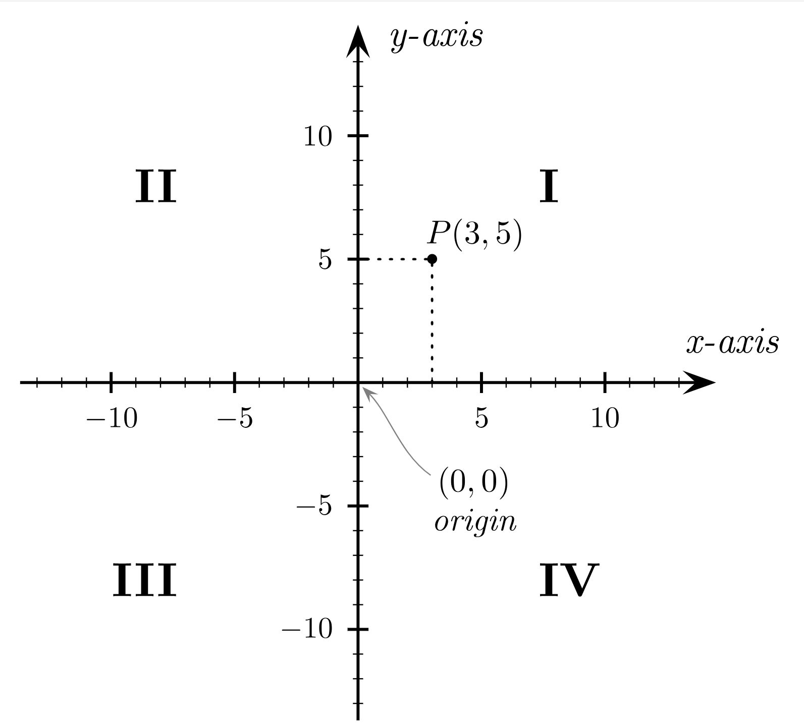

## 第一讲：空间位置与坐标系

> 作者：胡煜成

> 创立时间：2024/03

坐标可以用来描述物体的位置。例如我们可以借助经纬度来在地球上定位，你问我马里亚纳海沟在哪，我告诉你马里亚纳海沟位于北纬11°20，东经142°11.5，这样你就知道了马里亚纳海沟在地球上的哪个位置，不会弄错。

在使用坐标前，我们首先需要建立坐标系。坐标系的选取有很多种方法，比较常用的是**平面直角坐标系**和**空间直角坐标系**。

### 平面直角坐标系
如下图所示，一个平面直角坐标系由三个预设条件决定。

- **坐标原点**

    平面上的一个点，通常记作 $O$，表示 Origin。

- **坐标轴和正方向**
    
    确定坐标原点后，作两条过 $O$ 点的相互垂直的直线构成坐标轴，同时在每个坐标轴上取定一个正方向，用箭头表示。习惯上我们会取一条水平方向的直线作为 $X$-轴, 并规定往右为 $X$-轴的正方向；同时取一条竖直方向的直线作为 $Y$-轴, 并规定往上为 $Y$-轴的正方向。

- **单位长度**

    在确定坐标原点和坐标轴后，我们在每个坐标轴上取定一个单位长度，这样我们就可以给坐标轴标上数字，数字的大小对应该点到坐标原点的长度，数字的符号表示该点相对坐标原点的方向（正方向为正号，反方向为负号）。

建好了平面直角坐标系之后，平面内的任意一个位置都可以通过**坐标**来表示。如上图中的点 $P$, 经过该点分别向 $X$-轴 和 $Y$-轴 作垂线，垂线与 $X$-轴 交点为 3, 与 $Y$-轴交点为 5，于是点 $P$ 的坐标就是 $(3, 5)$。

可以看到，平面直角坐标系中的坐标是一个**有序数对**，**数对**表示坐标由两个数字组成，分别称为该点的 $X$分量和 $Y$分量。**有序**表示这两个数的顺序是不能随意交换的，请你试着在该坐标系里找一下坐标 $(5, 3)$ 对应的点，它跟点 $P$ 是同一个点吗？

在我们刚才得到的平面直角坐标系里有一个非常好的性质，那就是每一个点都对应一个坐标，每个坐标也都对应一个点，即所谓的点和坐标之间是**一一对应**的。事实上，我们在设计经纬度时也有同样的考虑，否则如果马里亚纳海沟有着两个不同的经纬度，或者（北纬11°20，东经142°11.5）同时对应马里亚纳海沟和珠穆朗玛峰，那就会给很多人带来麻烦。

从上图中我们可以看到，坐标系的两根坐标轴把平面分割成了 4 个不重叠的区域，为了方便，我们把这四个区域分别叫做**第I象限**，**第II象限**，**第III象限**和**第IV象限**。在这四个象限内内，点的坐标的符号分别为 (+, +), (-, +), (-, -) 和 (+, -)。

>小故事：笛卡尔与坐标系

### 空间直角坐标系

平面直角坐标系可以用来描述二维平面上点的位置，将它推广到三维空间中，我们便得到了空间直角坐标系。

。。。