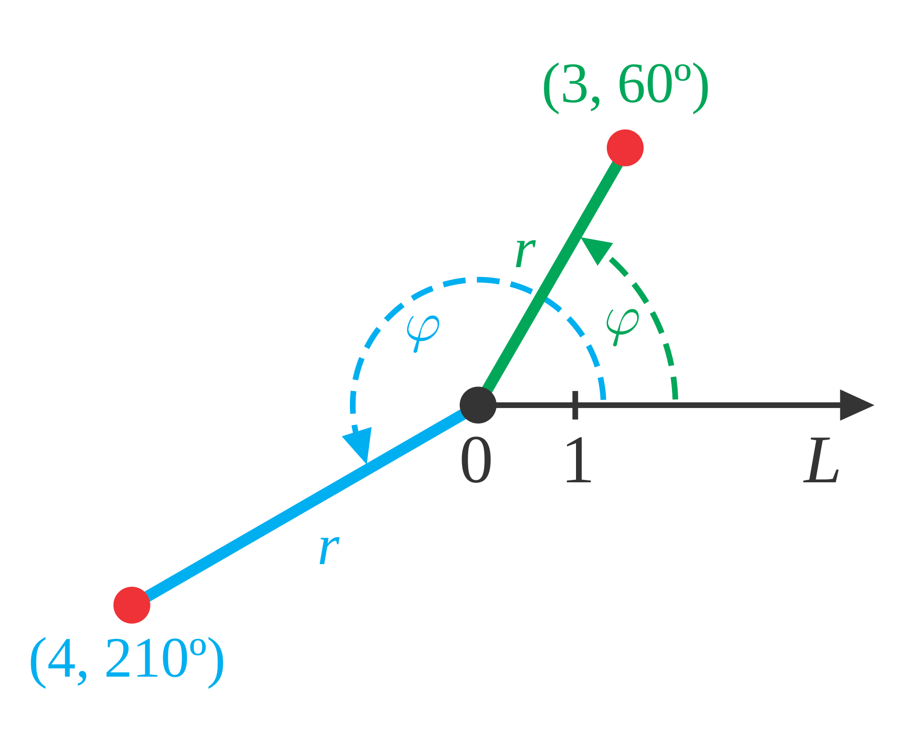

## 第一讲：空间位置与坐标系

> 作者：胡煜成

> 创立时间：2024/03

坐标可以用来描述物体的位置。例如我们可以借助经纬度来在地球上定位，你问我马里亚纳海沟在哪，我告诉你马里亚纳海沟位于北纬11°20，东经142°11.5，这样你就知道了马里亚纳海沟在地球上的哪个位置，不会弄错。

在使用坐标前，我们首先需要建立坐标系。坐标系的选取有很多种方法，比较常用的是**平面直角坐标系**和**空间直角坐标系**。

### 平面直角坐标系
如下图所示，一个平面直角坐标系由三个预设条件决定。

- **坐标原点**

    平面上的一个点，通常记作 $O$，表示 Origin。

- **坐标轴和正方向**
    
    确定坐标原点后，作两条过 $O$ 点的相互垂直的直线构成坐标轴，同时在每个坐标轴上取定一个正方向，用箭头表示。习惯上我们会取一条水平方向的直线作为 $X$-轴, 并规定往右为 $X$-轴的正方向；同时取一条竖直方向的直线作为 $Y$-轴, 并规定往上为 $Y$-轴的正方向。

- **单位长度**

    在确定坐标原点和坐标轴后，我们在每个坐标轴上取定一个单位长度，这样我们就可以给坐标轴标上数字，数字的大小对应该点到坐标原点的长度，数字的符号表示该点相对坐标原点的方向（正方向为正号，反方向为负号）。

建好了平面直角坐标系之后，平面内的任意一个位置都可以通过**坐标**来表示。如上图中的点 $P$, 经过该点分别向 $X$-轴 和 $Y$-轴 作垂线，垂线与 $X$-轴 交点为 3, 与 $Y$-轴交点为 5，于是点 $P$ 的坐标就是 $(3, 5)$。

可以看到，平面直角坐标系中的坐标是一个**有序数对**，**数对**表示坐标由两个数字组成，分别称为该点的 $X$分量和 $Y$分量。**有序**表示这两个数的顺序是不能随意交换的，请你试着在该坐标系里找一下坐标 $(5, 3)$ 对应的点，它跟点 $P$ 是同一个点吗？

在我们刚才得到的平面直角坐标系里有一个非常好的性质，那就是每一个点都对应一个坐标，每个坐标也都对应一个点，即所谓的点和坐标之间是**一一对应**的。事实上，我们在设计经纬度时也有同样的考虑，否则如果马里亚纳海沟有着两个不同的经纬度，或者（北纬11°20，东经142°11.5）同时对应马里亚纳海沟和珠穆朗玛峰，那就会给很多人带来麻烦。

从上图中我们可以看到，坐标系的两根坐标轴把平面分割成了 4 个不重叠的区域，为了方便，我们把这四个区域分别叫做**第I象限**，**第II象限**，**第III象限**和**第IV象限**。在这四个象限内内，点的坐标的符号分别为 (+, +), (-, +), (-, -) 和 (+, -)。

>小故事：笛卡尔与坐标系

### 空间直角坐标系

为了描述三维空间中目标的位置，我们可以使用**空间直角坐标系**。空间直角坐标系可以看作是二维平面直角坐标系在三维空间中的推广，就像是在经度和纬度的基础上再增加了一个距离海平面的高度，这样不仅能表示某个目标的位置，还能表示它的高度。例如马里亚纳海沟就可以表示为（北纬11°20，东经142°11.5，-11265米），而珠穆朗玛峰可以表示为（27°59′18″N， 86°55′31″E， 8848米）。

如下图所示，我们在平面直角坐标系的基础上增加一条过原点且垂直于 $X$-轴 和 $Y$-轴 的数轴，称为 $Z$-轴，同样也给 $Z$-轴选定正方向和单位长度，这样一个空间直角坐标系就建好了。

空间直角坐标系的三个数轴中的任意两个数轴都决定了一个平面，分别叫做 $XY$-平面，$YZ$-平面和 $XZ$-平面。如图所示，这三个平面也是相互垂直的。

在空间直角坐标系下，三维空间中的一个点的位置可以用一个三维数组 $(x, y, z)$ 表示，其中 $x$, $y$, $z$ 分别对应该点在 $X$-轴，$Y$-轴 和 $Z$-轴 上的投影处的位置。$x$, $y$, $z$ 也可以通过分别往$YZ$-平面，$XZ$-平面和 $XY$-平面作垂线的方法得到(请结合图片确认一下x~YZ, y~XZ, z~XY的对应关系)。跟平面直角坐标类似，三维空间中的点和空间直角坐标系的坐标之间也是**一一对应**的，坐标中三个数的位置也是不能随便交换的。

原则上三个坐标轴上的正方向可以任意的选取，不过习惯上我们更多的使用**右手坐标系**。下图给出了右手坐标系（右边）和左手坐标系（左边）的区别。确定右手坐标系的一个简单方法是：右手顺着从 $X$-轴正方向 往 $Y$-轴正方向 的方式握出一个拳头，伸出大拇指的方向就是右手坐标系 $Z$-轴 的正方向。大家可以伸出大拇指比划一下，非常好玩！

### 其它坐标系

**非笛卡尔坐标系**
上面所讲到的平面直角坐标系和空间直角坐标系都属于笛卡尔坐标系，根据实际问题的特点，人们往往还会采用其它的坐标系。这些坐标系的功能都包含对目标进行定位，只不过定位的方式各有不同。

例如，在极坐标系中，二维平面上的一个点的位置可以通过该点到原点的距离 $r$ 和该点与原点的连线与水平方向的旋转角 $\psi$ 来描述。在球坐标系中，三维平面上的一个点的位置可以通过该点到原点的距离 $r$ 和该点相对于参考球面的两个方位角来描述。在描述行星绕太阳公转运动的时候，用极坐标非常的方便。大家想想，如果让你来研究火箭发射的轨道，你会采用什么样的坐标系呢？

**高维坐标系**
目前我们只介绍了二维平面和三维空间的坐标系，坐标系同样是研究高维空间不可或缺的工具。笛卡尔坐标系可以很容易推广到高维空间中，例如5维空间中的一个点可以对应一个5维笛卡尔坐标系中的一个5维向量。关于向量的概念我们在下一节中介绍。